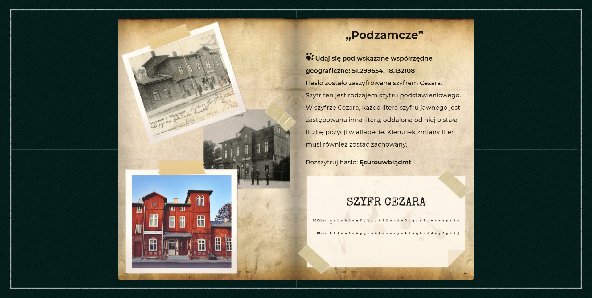

# Kod Wieruszowa - Game about Town
Podgląd na żywo [kodwieruszowa.pl](https://kodwieruszowa.pl/)

## Spis Treści
* [Ogólne Informacje](#ogólne-informacje)
* [Podgląd Projektu](#Podgląd-projektu)
* [Technologie](#technologie)
* [Lista Zadań](#lista-zadań)
* [Status](#status)
* [Kontakt](#kontakt)

## Ogólne Informacje
Gra została stworzona z myślą o ludziach którzy chcą lepiej poznać miasto Wieruszów. Celem rozgrywki jest pokonywanie następnych stron książki na których znajdują się łamigłówki kryptologiczne o różnym stopniu trudności. Dla graczy którzy nie radzą sobie z poziomem trudności zostały przygotowane różnorakie podpowiedzi. Podczas tworzenia tego projektu zależało mi przede wszystkim na pokazaniu kryptografii w ciekawym i zrozumiały dla odbiorcy sposób.

## Podgląd Projektu

## Technologie
* HTML & CSS
* JavaScript
* Node & Vue 2
* Integration with Strapi
* Simple-keyboard

## Lista Zadań
* Poprawa nazewnictwa funkcji
* Dodanie event bus
* Poprawa nazewnictwa css w metodologi bem

## Status
Projekt jest: Nie rozwijany, lecz rozważam możliwość dalszego kontynuowania prac.

## Kontakt
Stworzone przez [Szymona Musiała](https://www.musialdev.pl/) - sprawdź moje portfolio!
